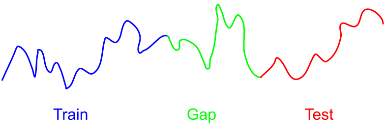

# TSCV: Time Series Cross-Validation

This repository is a [scikit-learn](https://scikit-learn.org) extension for time series cross-validation.
It introduces gaps between the training set and the test set, which mitigates the temporal dependence of time series and prevents information leak.



## Installation

This repository is not registered, but you can clone it into your own project and use it with ease.

```bash
git clone https://github.com/WenjieZ/TSCV.git tscv
mkdir YOURPROJECT/tscv
cp tscv/split.py YOURPROJECT/tscv/split.py
cp tscv/__init__.py YOURPROJECT/tscv/__init__
```

`YOURPROJECT` is the name of your project folder.

## Usage

This extension defines 3 cross-validator classes and 1 function:
- `GapLeaevPOut`
- `GapKFold`
- `GapWalkForward`
- `gap_train_test_split`

The three classes can all be passed, as the `cv` argument, to the `cross_val_score` function in `scikit-learn`, just like the native cross-validator classes in `scikit-learn`.

The one function is an alternative to the `train_test_split` function in `scikit-learn`.

## Examples

The following example uses `GapKFold` instead of `KFold` as the cross-validator.
```python
import numpy as np
from sklearn import datasets
from sklearn import svm
from sklearn.model_selection import cross_val_score
from tscv import GapKFold

iris = datasets.load_iris()
clf = svm.SVC(kernel='linear', C=1)

# use GapKFold as the cross-validator
cv = GapKFold(n_splits=5, gap_before=5, gap_after=5)
scores = cross_val_score(clf, iris.data, iris.target, cv=cv)
```

The following example uses `gap_train_test_split` to split the data set into the training set and the test set.
```python
import numpy as np
from tscv import gap_train_test_split

X, y = np.arange(20).reshape((10, 2)), np.arange(10)
X_train, X_test, y_train, y_test = gap_train_test_split(X, y, test_size=2, gap_size=2)
```

## Support
See the documentation [here](http://www.zhengwenjie.net/tscv/).

If you need any further help, please use the issue tracker.

## Authors
This extension is mainly developed by me, Wenjie Zheng.

The `GapWalkForward` cross-validator is adapted from the `TimeSeriesSplit` of `scikit-learn`.

## Acknowledgment
- I would like to thank Christoph Bergmeir, Prabir Burman, and Jeffrey Racine for the helpful discussion.
- I would like to thank Jacques Joubert for encouraging me to develop this package.

## License
BSD-3-Clause
