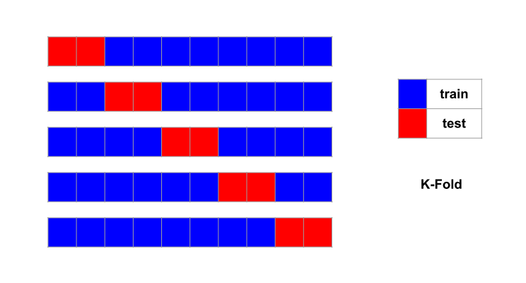
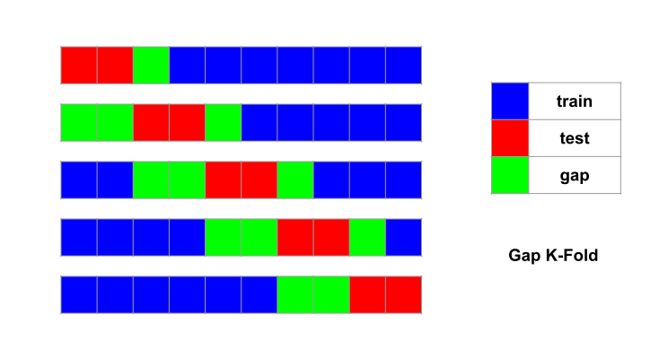

GapKFold
========

.. currentmodule:: tscv

This page describes K-fold and how to use gaps with it for time series.

The cross-validation known as **K-Fold** may be the most wildly used
cross-validation method in machine learning. It devides the sample
into :math:`K` folds and each time uses :math:`K-1` folds as training set
and the remaining 1 fold as test set. There are :math:`K` different
test sets in all. To ensure that the every group of :math:`K` data points
has equal chance of being choosed, the sample is shuffled before hand.
Since :math:`K \ll C_n^p`, it be more efficient than leave-p-out.

For time series cross-validation, the shuffle procedure is inappropriate.
We simply add gaps on both sides of the test fold. The gaps are borrowed
from neighouring training folds. That is the neighouring training folds
lose some sample points.

The following code snippet produces the cross-validation setup of the
above image. Notice how the gap size before the test set can be different
from the gap coming after:

.. code-block:: python

	>>> from tscv import GapKFold
	>>> cv = GapKFold(n_splits=5, gap_before=2, gap_after=1)
	>>> for train, test in cv.split(range(10)):
	...     print("train:", train, "test:", test)
	...
	train: [3 4 5 6 7 8 9] 	 test: [0 1]
	train: [5 6 7 8 9] 	 test: [2 3]
	train: [0 1 7 8 9] 	 test: [4 5]
	train: [0 1 2 3 9] 	 test: [6 7]
	train: [0 1 2 3 4 5] 	 test: [8 9]

In the code sample, :class:`GapKFold` is a class provided by this package.
It has a :meth:`~GapKFold.split` method, which takes in the whole data set and produce
the training and test sets indices.

.. tip::
   By calling the :meth:`~GapKFold.split` method directly, you can verify whether your
   configuration is what you desire. In practice, you will not use these
   indices directly though. Rather, you will send an instance of
   :class:`GapKFold` as argument to a scikit-learn cross-validator.
