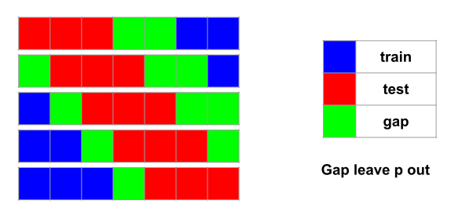

GapLeavePOut
============
.. currentmodule:: tscv

This page describes leave-p-out and how to use gaps with it for time series.

The cross-validation known as **Leave-P-Out** refers to leave :math:`p`
sample points out from the training set and use them as the test set.
The :math:`p` points do not have to be contiguous; for a sample with
:math:`n` points, there can be :math:`C_n^p` different test sets.

For time series cross-validation, it is more sensible to require the
test set to be contiguous so that the gaps can be minimized. The shorter
the gaps are, the more data we can use to train and test our algorithms.
For a sample with :math:`n` points, there can be :math:`n-p+1` different
test sets, regardless of the gap sizes.

The following code snippet produces the cross-validation setup of the
above image. Notice how the gap size before the test set can be different
from the gap coming after:

.. code-block:: python

	>>> from tscv import GapLeavePOut
	>>> cv = GapLeavePOut(p=3, gap_before=1, gap_after=2)
	>>> for train, test in cv.split(range(7)):
	...     print("train:", train, "test:", test)
	...
	train: [5 6]   test: [0 1 2]
	train: [6]     test: [1 2 3]
	train: [0]     test: [2 3 4]
	train: [0 1]   test: [3 4 5]
	train: [0 1 2] test: [4 5 6]

In the code sample, :class:`GapLeavePOut` is a class provided by this package.
It has a :meth:`~GapLeavePOut.split` method, which takes in the whole data set and produce
the training and test sets indices.

.. tip::
   By calling the :meth:`~GapLeavePOut.split` method directly, you can verify whether your
   configuration is what you desire. In practice, you will not use these
   indices directly though. Rather, you will send an instance of
   :class:`GapLeavePOut` as argument to a scikit-learn cross-validator.
