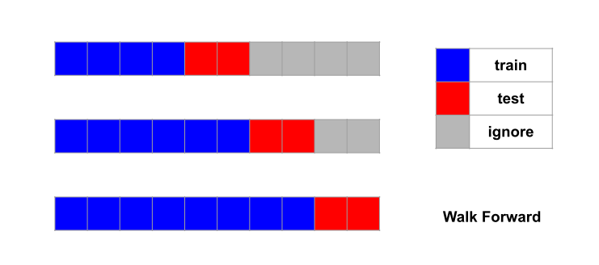
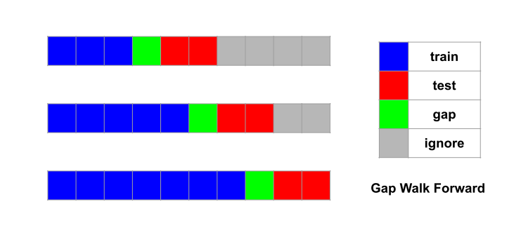

GapRollForward
==============

.. currentmodule:: tscv

This page presents the :class:`GapRollForward` class.

Rolling Forward, better known as Walk Forward, is a popular
cross-validation method for time series. In contrast to
:class:`GapLeavePOut` and :class:`GapKFold`, which both allow
training sets on **both** sides of the test set, Walk Forward
requires that the training set must be before the test set.
That is, inference from (past) data can only be validated on
*future* data.

The :class:`GapRollForward` class simply introduces gaps into vanilla
Walk Forward.

The following code snippet produces the cross-validation setup of the
above image:

.. code-block:: python

	>>> from tscv import GapRollForward
	>>> cv = GapRollForward(min_train_size=3, gap_size=1, max_test_size=2)
	>>> for train, test in cv.split(range(10)):
	...     print("train:", train, "test:", test)
	...
	train: [0 1 2] test: [4 5]
	train: [0 1 2 3 4] test: [6 7]
	train: [0 1 2 3 4 5 6] test: [8 9]

In the code sample, :class:`GapRollForward` is a class provided by this
package. It has a :meth:`~GapRollForward.split` method, which takes in the whole data set
and produce the training and test sets indices.

.. tip::
   By calling the :meth:`~GapRollForward.split` method directly, you can verify whether your
   configuration is what you desire. In practice, you will not use these
   indices directly though. Rather, you will send an instance of
   :class:`GapRollForward` as argument to a scikit-learn cross-validator.
