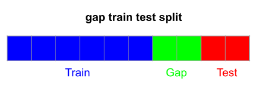

gap_train_test_split
====================

.. currentmodule:: tscv

This page presents the :func:`gap_train_test_split` *function*.
It is a one-liner splitting arrays into training set and test sets
while removing the gaps.

Let us check out an example:

.. code-block:: python

	>>> import numpy as np
	>>> from tscv import gap_train_test_split
	>>> X, y = np.arange(20).reshape((10, 2)), np.arange(10)
	>>> X_train, X_test, y_train, y_test = gap_train_test_split(
	...	    X, y, test_size=2, gap_size=2)
	...
	>>> print(X_train)
	[[ 0  1]
 	 [ 2  3]
 	 [ 4  5]
 	 [ 6  7]
 	 [ 8  9]
 	 [10 11]]
	>>> print(X_test)
	[[16 17]
 	 [18 19]]
	>>> print(y_train)
	[0 1 2 3 4 5]
	>>> print(y_test)
	[8 9]
